# CLAUDE.md

This file provides guidance to Claude Code (claude.ai/code) when working with code in this repository.

## What this repository is

GitHub **profile repository** — the repo name (`Miou-zora`) matches the owner's username, so `README.md` renders directly on <https://github.com/Miou-zora>. There is no build system, no tests, and no dependencies.

Consequences:
- Nothing to build, lint, run, or test. Do not propose or scaffold a toolchain unless explicitly asked.
- Verify by rendering the Markdown and by opening the SVGs in a browser, not by running anything.
- Pushing to `main` publishes immediately to a public profile page. Treat every commit here as outward-facing.

## Layout

```
README.md                        the live profile page (currently the NieR: Automata theme)
kaine.png                        old hero image, unused by the current README
assets/<theme>/<part>-{light,dark}.svg   generated art, one pair per part
themes/README.md                 index of the alternative themes
themes/README.<theme>.md         the alternatives, kept so they are not lost
themes/generate.py               generates everything under assets/
```

Themes currently present: `evangelion`, `nier-automata`, `nier-replicant`.

## The theme system

**Do not hand-edit files under `assets/`.** They are generated. Palettes and SVG
templates live in `themes/generate.py`; edit that and re-run `python3 themes/generate.py`
from anywhere. It rewrites every variant, which is what keeps a light and dark pair
from drifting apart.

Hard constraints this design works around, all verified against GitHub itself:

- **GitHub strips CSS from Markdown.** `style="..."`, `<style>`, `<marquee>` and external stylesheets are removed. Only `align`, `width`/`height`, tables, `<br>` and `<details>` affect layout. All real design therefore lives *inside* the SVGs.
- **CSS `@keyframes` inside a self-contained SVG survive** GitHub's camo proxy, so the art can animate. JS, `@import` fonts and external URLs do not survive — every SVG must stay self-contained.
- **A media query inside an SVG loaded via `` cannot see the page**, so it follows the viewer's OS appearance, not their GitHub theme. Do not rely on it.
- **`<picture>` is the supported mechanism.** GitHub rewrites it to its own `<themed-picture>` element and resolves the source with the GitHub theme setting. Hence the `-light` / `-dark` pairs:

```html
<picture>
  <source media="(prefers-color-scheme: dark)" srcset="assets/nier-automata/banner-dark.svg">
  
</picture>
```

Canvases are transparent with the coloured field inset, so the page colour breathes around each panel instead of a hard rectangle butting against GitHub's background.

Theme files under `themes/` reference `../assets/`; `README.md` references `assets/`. Swapping a theme in means copying the file over `README.md` and rewriting that prefix.

### NieR: Automata specifics

Tokens come from the yorha-css framework source, not invention: field `#d1cdb7`, grid `#ccc8b1`, ink `#454138`, reversed text `#dcd8c0`, shadow `#bab5a1`. The signatures worth preserving are the 5px background grid, the light-weight uppercase title with a *hard* offset shadow (no blur), row markers made of a fat bar **and** a separate thin bar (`border-width: 0 0.2rem 0 0.6rem`), and panels edged on right and bottom only.

Row text is column-aligned by construction: labels at x=98 / x=681, dashed leaders at 212–288 / 795–871, values at x=302 / x=885, every baseline 20px into its 30px row. Keep those columns if you add rows.

## Content rules

The prose is deliberately conservative about skill claims. Languages and tools are listed only where they are genuinely used — C++, C, Python, Unity, Docker, xmake. Zig, Nix, Go, Rust, TypeScript and Godot appear as facts about specific projects, never as claimed skills. Preserve that distinction.

Project links must resolve publicly. Several repos have gone private over time (`GravityFight`, `Queng123/tapply`, `Queng123/Jam`); those are named without links and marked private.

## Checks worth running before pushing

- Every image has meaningful `alt`; one badge style per file.
- Every referenced asset resolves from that file's own directory.
- `gh api -X POST /markdown -f mode=gfm -f text="$(cat README.md)"` and confirm `themed-picture`, tables and `<details>` survive.
- SVGs parse as XML and contain no `<script>`, no external URL, no unsubstituted `{TOKEN}`.
- Third-party image hosts still respond. `github-readme-stats.vercel.app` is currently down (`503 DEPLOYMENT_PAUSED`); the streak card uses `streak-stats.demolab.com`, which works.

## Commits

History uses plain imperative sentences (e.g. "Update README with new profession and project details"), not Conventional Commits.
