<picture>
  <source media="(prefers-color-scheme: dark)" srcset="../assets/nier-automata/banner-dark.svg">
  
</picture>

## <samp>W H O &nbsp; I S &nbsp; S P E A K I N G</samp>

I'm Alexandre Franquet, a French CS teacher at [Epitech](https://www.epitech.eu/). I mostly write C++ and C. Most of what's here started because I wanted to know how something worked, so I rebuilt it: an engine, a raytracer, a game's network protocol.

Also a big fan of [Osu!](https://osu.ppy.sh/users/10330495) and [DrakeNieR](https://www.jp.square-enix.com/nierautomata/).
Away from the keyboard I do photography, mostly macro.

<picture>
  <source media="(prefers-color-scheme: dark)" srcset="../assets/nier-automata/divider-dark.svg">
  
</picture>

## <samp>C U R R E N T &nbsp; M I S S I O N</samp>

**Wagoon** is the game I'm building right now: an automation game where you route goods along rails, with wagons doing the hauling. It's where most of my recent commits go, and it's what the engine and renderer work was practice for. The repo is still private.

<picture>
  <source media="(prefers-color-scheme: dark)" srcset="../assets/nier-automata/divider-dark.svg">
  
</picture>

## <samp>C O M B A T &nbsp; D A T A</samp>

| UNIT | FUNCTION | CORE |
| :-- | :-- | :-- |
| [**Engine²**](https://github.com/EngineSquared/EngineSquared) | Open-source game engine, with a [WebGPU plugin](https://github.com/Miou-zora/WebGPU-Squared), Jolt physics and an [xmake package repo](https://github.com/EngineSquared/xrepo) | `C++` |
| [**SniffSniffSquared**](https://github.com/Miou-zora/SniffSniffSquared) | Sniffer and protobuf decoder for the Dofus 3 protocol, with a trading dashboard on top | `Rust` `Next.js` |
| [**R-Type**](https://github.com/Miou-zora/R-Type) | R-Type for 4 players, on an ECS written from scratch | `C++` |
| [**Raytracer**](https://github.com/Miou-zora/Raytracer) | Raytracer that approximates a surface's light rays with the Monte Carlo method | `C++` |
| [**Whanos**](https://github.com/Miou-zora/Whanos) | GCP project creator, using Terraform, Kubernetes, Ansible, Jenkins, Helm and Docker | `HCL` |
| [**lib-C-ursed**](https://github.com/Miou-zora/lib-C-ursed) | A libmy that pushes ternary and recursive functions way too far | `C` |

<b>A R C H I V E D &nbsp; R E C O R D S</b>

 

- [Zaytracer](https://github.com/Miou-zora/Zaytracer), a raytracer in Zig
- [Zix](https://github.com/Miou-zora/Zix), spline visualiser with Raylib + Zig + Nix
- [Raylib-Zig-Nix](https://github.com/Miou-zora/Raylib-Zig-Nix), minimal Raylib + Zig + Nix project
- [WoRm](https://github.com/Miou-zora/WoRm) / [WoRm²](https://github.com/Miou-zora/WoRm2), a worm inspired by Terraria's Devourer of Gods, in Rust & Bevy, then redone on Engine²
- [Eidolon](https://github.com/Miou-zora/Eidolon), a game engine in Python, to try ECS there
- [SniffSniff](https://github.com/Miou-zora/SniffSniff), Dofus 2 packet sniffer and translator, in Go
- [Gravity Fight](https://github.com/Miou-zora/gravity-fight), 2D multiplayer arcade game in Godot, with three classmates
- [MyRiokart](https://github.com/Miou-zora/MyRiokart), a Mario Kart Wii clone in Unity
- [Zappy](https://github.com/Miou-zora/Zappy), a game where AIs try to reproduce, in C
- [Area](https://github.com/Miou-zora/Area), IFTTT replica with React / React Native and NestJS, on Oracle Cloud
- [Replic](https://github.com/Miou-zora/Replic), CI/CD project creator that mirrors Epitech projects
- [Oracle-AnsibleMine](https://github.com/Miou-zora/Oracle-AnsibleMine), Minecraft server setup for OCI
- [Keimyung-Computer-Graphic](https://github.com/Miou-zora/Keimyung-Computer-Graphic), computer graphics coursework from KMU
- [sudoku-JAVA-ccursed](https://github.com/Miou-zora/sudoku-JAVA-ccursed), a sudoku solver made of Java streams
- [Xmake-OpenGl](https://github.com/Miou-zora/Xmake-OpenGl) and [HelloWorldXmakePackage](https://github.com/Miou-zora/HelloWorldXmakePackage-Package), xmake templates and packaging tests
- Tapply, an AR Death Star scene with HTC trackers, a Monster energy collection tool *(private or offline)*

<b>J A M &nbsp; O P E R A T I O N S</b>

 

<picture>
  <source media="(prefers-color-scheme: dark)" srcset="../assets/nier-automata/divider-dark.svg">
  
</picture>

<picture>
  <source media="(prefers-color-scheme: dark)" srcset="../assets/nier-automata/pod-dark.svg">
  
</picture>
