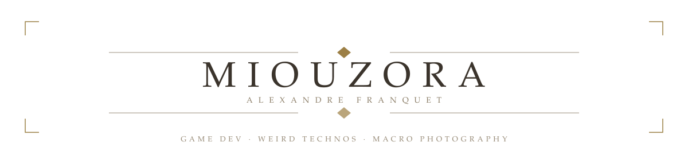

<picture>
  <source media="(prefers-color-scheme: dark)" srcset="../assets/nier-replicant/banner-dark.svg">
  
</picture>

<picture>
  <source media="(prefers-color-scheme: dark)" srcset="../assets/nier-replicant/rule-dark.svg">
  
</picture>

### <samp>i.&nbsp;&nbsp;the one who teaches</samp>

I'm Alexandre Franquet, a French CS teacher at [Epitech](https://www.epitech.eu/). I mostly write C++ and C. Most of what's here started because I wanted to know how something worked, so I rebuilt it: an engine, a raytracer, a game's network protocol.

Also a big fan of [Osu!](https://osu.ppy.sh/users/10330495) and [DrakeNieR](https://www.jp.square-enix.com/nierautomata/).
Away from the keyboard I do photography, mostly macro.

### <samp>ii.&nbsp;&nbsp;what is being written now</samp>

**Wagoon** — an automation game with wagons and rails. *(currently private)*

<picture>
  <source media="(prefers-color-scheme: dark)" srcset="../assets/nier-replicant/rule-dark.svg">
  
</picture>

### <samp>iii.&nbsp;&nbsp;the chapters before</samp>

**[Engine²](https://github.com/EngineSquared/EngineSquared)** &nbsp;·&nbsp; `C++`
Open-source game engine, with a [WebGPU plugin](https://github.com/Miou-zora/WebGPU-Squared), Jolt physics and an [xmake package repo](https://github.com/EngineSquared/xrepo).

**[SniffSniffSquared](https://github.com/Miou-zora/SniffSniffSquared)** &nbsp;·&nbsp; `Rust` `Next.js`
Sniffer and protobuf decoder for the Dofus 3 protocol, with a trading dashboard on top.

**[R-Type](https://github.com/Miou-zora/R-Type)** &nbsp;·&nbsp; `C++`
R-Type for 4 players, on an ECS written from scratch.

**[Raytracer](https://github.com/Miou-zora/Raytracer)** &nbsp;·&nbsp; `C++`
Raytracer that approximates a surface's light rays with the Monte Carlo method.

**[Whanos](https://github.com/Miou-zora/Whanos)** &nbsp;·&nbsp; `HCL`
GCP project creator, using Terraform, Kubernetes, Ansible, Jenkins, Helm and Docker.

**[lib-C-ursed](https://github.com/Miou-zora/lib-C-ursed)** &nbsp;·&nbsp; `C`
A libmy that pushes ternary and recursive functions way too far.

<i>iv. &nbsp;the rest of the library</i>

 

- [Zaytracer](https://github.com/Miou-zora/Zaytracer), a raytracer in Zig
- [Zix](https://github.com/Miou-zora/Zix), spline visualiser with Raylib + Zig + Nix
- [Raylib-Zig-Nix](https://github.com/Miou-zora/Raylib-Zig-Nix), minimal Raylib + Zig + Nix project
- [WoRm](https://github.com/Miou-zora/WoRm) / [WoRm²](https://github.com/Miou-zora/WoRm2), a worm inspired by Terraria's Devourer of Gods, in Rust & Bevy, then redone on Engine²
- [Eidolon](https://github.com/Miou-zora/Eidolon), a game engine in Python, to try ECS there
- [SniffSniff](https://github.com/Miou-zora/SniffSniff), Dofus 2 packet sniffer and translator, in Go
- [Gravity Fight](https://github.com/Miou-zora/gravity-fight), 2D multiplayer arcade game in Godot, with three classmates
- [MyRiokart](https://github.com/Miou-zora/MyRiokart), a Mario Kart Wii clone in Unity
- [Zappy](https://github.com/Miou-zora/Zappy), a game where AIs try to reproduce, in C
- [Area](https://github.com/Miou-zora/Area), IFTTT replica with React / React Native and NestJS, on Oracle Cloud
- [Replic](https://github.com/Miou-zora/Replic), CI/CD project creator that mirrors Epitech projects
- [Oracle-AnsibleMine](https://github.com/Miou-zora/Oracle-AnsibleMine), Minecraft server setup for OCI
- [Keimyung-Computer-Graphic](https://github.com/Miou-zora/Keimyung-Computer-Graphic), computer graphics coursework from KMU
- [sudoku-JAVA-ccursed](https://github.com/Miou-zora/sudoku-JAVA-ccursed), a sudoku solver made of Java streams
- [Xmake-OpenGl](https://github.com/Miou-zora/Xmake-OpenGl) and [HelloWorldXmakePackage](https://github.com/Miou-zora/HelloWorldXmakePackage-Package), xmake templates and packaging tests
- Tapply, an AR Death Star scene with HTC trackers, a Monster energy collection tool *(private or offline)*

<i>v. &nbsp;games made in a weekend</i>

 

<picture>
  <source media="(prefers-color-scheme: dark)" srcset="../assets/nier-replicant/rule-dark.svg">
  
</picture>

> [!IMPORTANT]
> You can contact me on discord (miouzora) for anything.
